# 拾宠 - 宠物领养平台 (客户端)

基于 Vue3、Pinia、VueRouter、Vite、 Vant、TypeScript 的"拾宠 - 宠物领养平台"后台管理系统。

## 介绍

本项目为"拾宠 - 宠物领养平台"客户端，可通过[拾宠 - 宠物领养平台 (服务端)](https://github.com/834772509/pet-adopt-server)进行部署后端程序。

### 项目图片

- 主页

  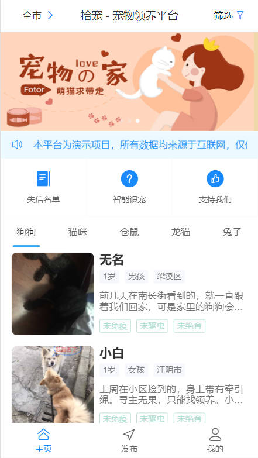

  - 筛选数据
    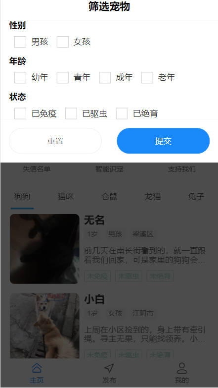
  - 宠物详情
    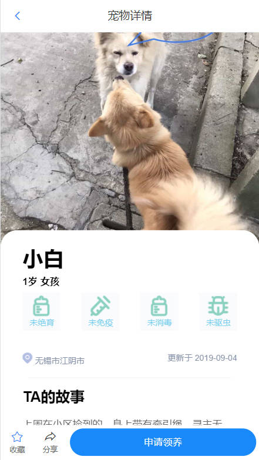
    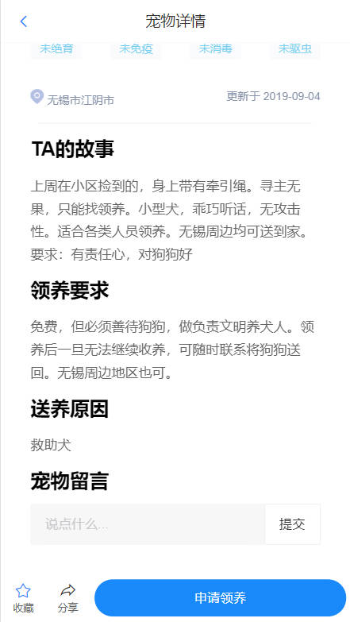

- 注册登录页面

  - 注册
    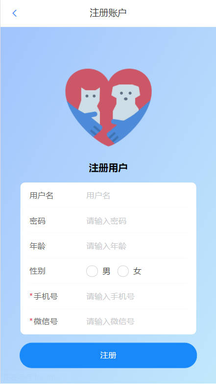
  - 登录
    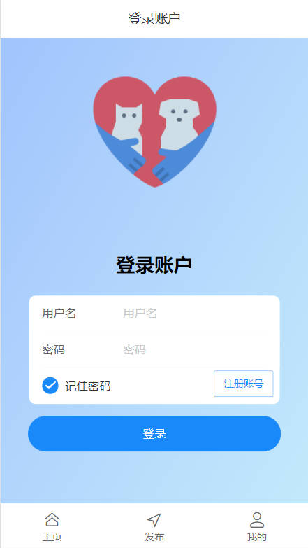

- 申请领养
  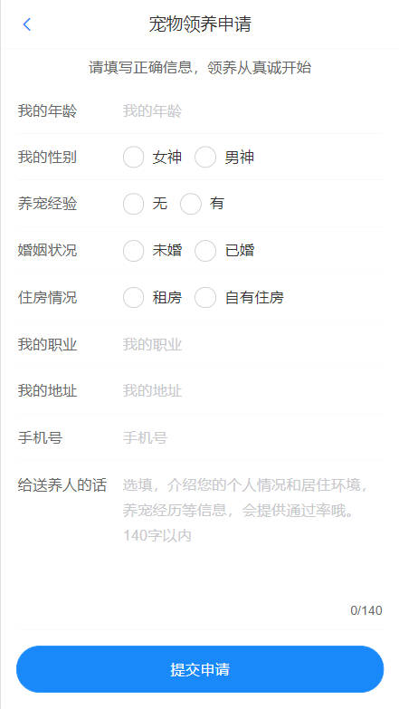

- 发布

  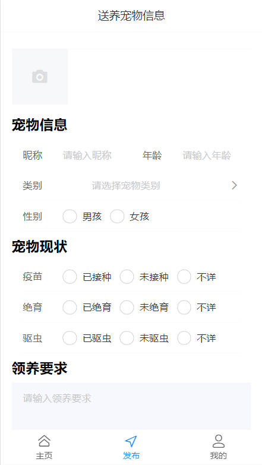

- 我的

  

  - 送养列表
    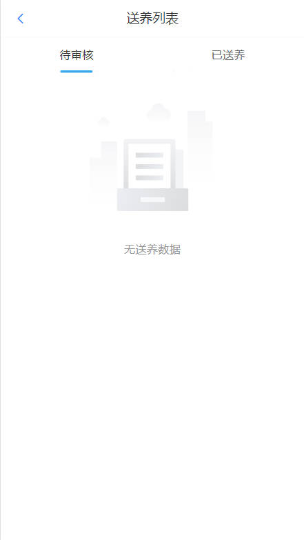
  - 申请列表
    
  - 领养申请
    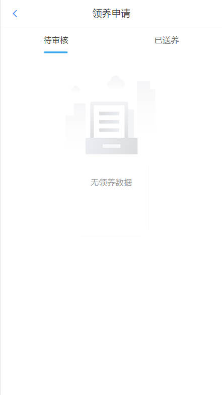
  - 收藏列表
    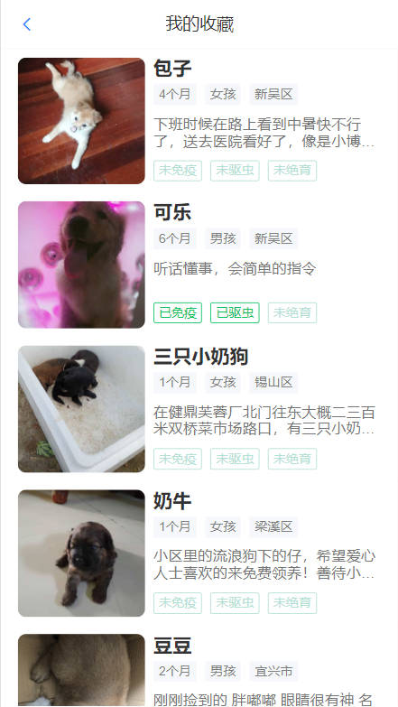

### 项目技术栈

- 开发工具 : Visual Studio Code
- 编程语言 : TypeScript 4.x + JavaScript
- 构建工具 : Vite 3.x
- 前端框架 : Vue 3.x
- 路由工具 : Vue Router 4.x
- 状态管理 : Pinia 2.x
- UI 框架 : Vant 4.x
- 工具库 : lodash + dayjs + copy-to-clipboard
- CSS 预编译 : Less
- HTTP 工具 : Axios
- Git Hook 工具 : husky
- 代码规范 : EditorConfig + Prettier + ESLint
- 提交规范 : Commitizen + Commitlint

## 运行项目

1. 安装依赖：`npm install`
2. 启动项目: `npm run dev`

### 打包部署

1. 安装依赖：`npm install`
2. 打包项目: `npm run build`
3. 本地测试: `npm run preview`
4. 文件系统访问支持
   - 使用[@vitejs/plugin-legacy](https://github.com/vitejs/vite/tree/main/packages/plugin-legacy)
   - 移除 <script type=module> 元素
   - 移除其他 <script> 的 nomodule 属性
   - 移除 <script id=vite-legacy-entry> 元素的内容，并把 data-src 属性名改为 src
   - 移除 SystemJS loader 代码（那个压缩到一行的 <script>）
   - 修改所有资源地址为相对地址（例如把 /assets/index-legacy.xxxx.js 改为 ./assets/index-legacy.xxxx.js，注意还有 CSS 文件）

## 项目规范

|                       |                                                                         |
| --------------------- | ----------------------------------------------------------------------- |
| 组件的文件            | 统一小写, 多个单词使用-分割                                             |
| 组件的目录结构        | 例如 button 组件：button/src/index.vue, 统一在 button/index.ts 导出     |
| 组件导包顺序          | 导 vue 技术栈的包 , 导第三方的工具函数 , 导本地的组件, 导本地的工具函数 |
| 组件的名称            | 统一大写开头，驼峰命名                                                  |
| 组件属性顺序          | name, components, props, emits, setup ...                               |
| template 标签         | 小写加 - ( 例如：&lt;case-panel/&gt; )                                  |
| template 标签属性顺序 | v-if , v-for , ref, class, style, ... ,事件                             |
| 组件的 props          | 小写开头，驼峰命名，必须编写类型默认值                                  |
| 组件的样式            | 作用域：scoped, lang = scss / less ; 类名：统一小写, 多个单词使用-分割  |

## Git 提交规范

|             |                |
| ----------- | -------------- |
| add 操作    | git add        |
| commit 操作 | npm run commit |
| pull 操作   | git pull       |
| push 操作   | git push       |
